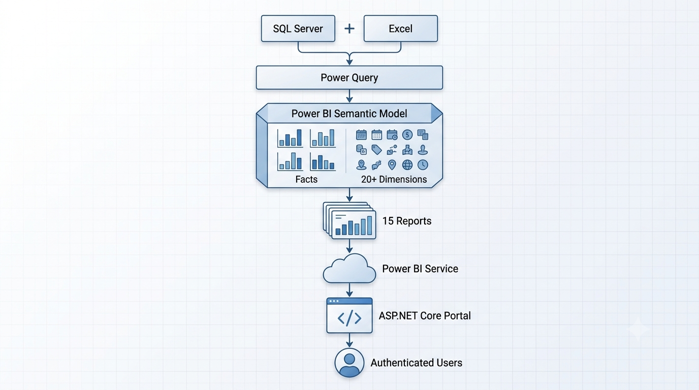

# Enterprise Power BI Reporting Platform

## Overview

This repository showcases an enterprise Power BI reporting platform developed to support financial performance monitoring, exposure analysis, and management reporting.

The solution consisted of 15 interactive Power BI reports built using SQL Server, DAX, Power Query, and Power BI Service. Users were able to explore data dynamically through slicers, filters, drill-through functionality, and interactive visualisations.

In addition to report development, the platform incorporated secure report access through role-based permissions and an ASP.NET Core embedded reporting portal.

> **Note:** Due to confidentiality requirements, report data, business-specific information, and source code have been anonymised.

---

## Project Highlights

* Developed 15 Power BI reports and dashboards
* Built semantic models using 4–5 fact tables and 20+ dimension tables
* Integrated SQL Server and Excel data sources
* Created DAX measures and time-intelligence calculations
* Implemented interactive reporting using slicers, filters, and drill-through pages
* Applied Row-Level Security (RLS) and Role-Based Access Control (RBAC)
* Contributed to an ASP.NET Core embedded reporting portal
* Implemented secure report access using claims-based authentication and server-side authorisation

---

## Architecture

The reporting solution followed the architecture below:

---

## Data Model

The Power BI semantic model was designed using a fact and dimension approach to support scalable reporting and analytics.

* 4–5 fact tables
* 20+ dimension tables
* SQL Server and Excel data sources
* Relationship-driven reporting model

---

## Report Showcase

## Top N Analysis

Interactive report enabling users to dynamically rank customers, products, commodities, countries, and sites based on selected exposure metrics and business dimensions.

Features:

* Dynamic Top N calculations
* Interactive slicers and filters
* Cross-filtering across visuals
* Comparative analysis across business dimensions

---

## Revenue Analysis

Interactive reporting dashboard used for monitoring revenue performance and identifying trends across reporting periods.

---

## World Trend Analysis

Geographic reporting dashboard providing exposure and performance analysis across countries and regions.

---

## Heat Map Analysis

Heat map visualisation used to identify concentration patterns and regional exposure trends.

%20-%20Report.png)

---

# Embedded Reporting Portal

The Power BI reports were integrated into an ASP.NET Core reporting application that controlled report visibility based on user permissions.

Key capabilities:

* Secure user authentication
* Role-based report access
* Embedded Power BI reporting
* Claims-based authorisation
* Server-side access controls

### Login Page

Secure login interface for the ASP.NET Core reporting portal, used to authenticate users before granting access to embedded Power BI reports.

---

## Security Controls

* Row-Level Security (RLS)
* Role-Based Access Control (RBAC)
* Claims-Based Authentication
* ASP.NET Core Authorisation
* Content Security Policy (CSP)
* Secure Password Hashing
* Server-side Input Validation

---

## Technologies Used

### Business Intelligence

* Power BI
* Power BI Service
* DAX
* Power Query

### Data

* SQL Server
* SQL

### Development

* ASP.NET Core
* C#

### Version Control

* Git
* GitLab

---

## Key Learnings

This project strengthened my skills in:

* Power BI development
* Data modelling
* DAX calculations
* Interactive reporting
* Report security/Application security
* Embedded analytics
* Stakeholder-focused reporting solutions
